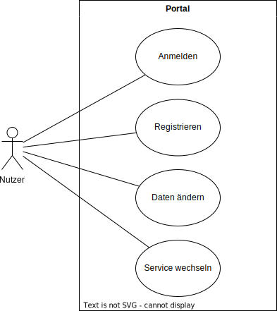

# Projektübersicht *Smart City*

**Autor:** Daniel Fast & Luca Humke

## Beschreibung

Smart City ist ein Portal, das mehrere Smarte Services der Stadt verknüpft, sodass Nutzer einen intelligenten und intuitiven Nutzen aus dem Portal der Stadt ziehen können. Es verknüpft z.B. das Portal mit dem Banksystem und dem Fahrzeugverleih. Es wird nur ein Account benötigt, damit loggt man sich im Portal ein. Das Portal liefert die Nutzerdaten dann an die jeweiligen Services weiter. Wenn ein Nutzer ein Auto mieten möchte, wird der zu zahlende Betrag direkt an das Banksystem vermittelt, ohne das weitere Eingaben nötig sind.

## Github Repository

Das Projekt wird durch die Organisation Smart City SoSe 2022 durchgeführt und enthält ein Project Board und alle Repositories zum Projekt, welches unter folgendem Link verfügbar ist: [Smart-City-SoSe-2022](https://github.com/Smart-City-SoSe-2022).

## Ziele

Smart City soll der Zeit entsprechend eine moderne Webseite für eine Kommune sein, so wie es von vielen anderen Internetdienstanbietern bekannt ist. Die fortschreitende Digitalisierung in allen Bereichen des Lebens führt dazu, dass auch eine Digitalisierung der Services einer Kommune und deren Vernetzung möglich sind. Ein starker Fokus liegt dabei auf der Beschleunigung und Automatisierung von Prozessen innerhalb einer Kommune, die bekanntlich wegen überforderten Bearbeitern oft im Verzug sind. Aber auch die verschiedenen Dienste und Aktivitäten, die in einer Stadt angeboten werden, können sinnvoll verknüpft werden, um ein besseres und einfacheres Erlebnis zu bieten. <br>
Smart City umfasst das Portal, in dem sich die Nutzer anmelden und registrieren können, und die jeweiligen Microservices, die verschiedene Mehrwerte bieten. Ein besonderes Alleinstellungsmerkmal ist der Single Account für alle Services. Man benötigt nicht mehr einen Account für jeden einzelnen Service. Weiterhin synchronisieren die Services untereinander ihre Daten. <br>
Da es sich um sensible Daten handelt und viele Nutzer gleichzeitig das Portal nutzen, wird es für Sicherheit, Zuverlässigkeit und Performanz optimiert. <br>
Die Zielgruppe sind die Bewohner der Stadt. Diese sind hauptsächlich Personen ab 18 Jahren, die den Dienst verschiedener Services benötigen. Damit das Portal einfach nutzbar ist, ist es so gestaltet, dass keine Vorkenntnisse nötig sind. <br>
Das Portal ersetzt jedoch nicht die einzelnen Ämter. Es wird weiterhin spezielle Probleme geben, die nicht über ein Portal lösbar sind und die persönliche Hilfe eines Bearbeiters in einem Amt bedarf.

## Risiken

**Smart City SWOT-Analyse**

| | Chancen im Markt | Risiken im Markt |
|:---:|---|---|
| **eigene Stärke** | **Chance:** Es werden alltäglich Services der Stadt benötigt <br><br> **Stärke:** Portal verlinkt und synchronisiert verschiedene Services der Stadt, sodass nicht überall einzeln nachgehakt werden muss | **Risiko:** Andere Apps wollen die Verlinkung der Stadt ebenfalls anbieten <br><br> **Stärke:** Praxiserfahrung aus mehreren Projekten |
| **eigene Schwäche** | **Chance:** Viele Dienste wollen in Zukunft digitalisiert werden <br><br> **Schwäche:** Portal beschränkt sich bisher nur auf bereits digitalisierte Dienste | **Risiko:** Kunden wollen gerne wegen der Bequemlichkeit alles digital lösen <br><br> **Schwäche:** Manche Dienste sind nicht genug digitalisiert und können nicht im Portal angeboten werden |

Fazit:
1. Bei der Digitalisierung anderer Dienste mitwirken
2. Schnell neue digitalisierte Dienste in das Portal integrieren

#### Umsetzbarkeit

Das Team hinter Smart City hat schon mehrmals Webservices aufgebaut. Die Kompetenzen sind vorhanden und ausgebaut, sodass das Projekt in größten Teilen umsetzbar sein sollte.

#### Weitere Risiken

Jedoch gibt es auch eine Risiken und Nebeneffekte, die zu erwarten sind. Dazu gehört, dass das Full Stack Development bisher noch nicht von jedem Teammitglied praktiziert wurde, da meistens die Arbeit in Frontend und Backend aufgeteilt wurde. Somit ist eine Einarbeitungszeit in Front- oder Backend erwartet. Das bedeutet gleichzeitig auch, dass das Risiko für den Sourcecode besteht, nicht qualitativ zu werden, da gleichzeitig zur Umsetzung des Front- oder Backend der Umgang mit dieser Technologie auch noch erlernt werden muss. Das alles führt dann wegen der Deadline des Projektes noch zu zusätzlichem Druck.

## Stakeholder

| Funktion / Relevanz | Name | Kontakt / Verfügbarkeit | Wissen  | Interessen / Ziele  | 
|---|---|---|---|---|
| Product-Owner, Entscheider - als Koordinator der Stakeholderanforderungen | Daniel Fast | daniel.fast@fh-bielefeld.de, GitHub: @mrdanf, 9 - 18 Uhr, Verfügbarkeit 70%, Löhne | Produktvision, Stakeholderinput | Qualitatives Produkt erstellen |
| Administrator, Serverbetreiber | Frau Munter | Tel.: 057187321, munter@mindenservers.de, 8 - 16 Uhr, Verfügbarkeit 80%, Minden | Erfahrung mit Smarten Diensten, Erfahrung in Wartungsarbeiten | Stabiler und Sicherer Service mit wenig Ausfallzeiten |
| Bürger | Herr Meister | Tel.: 057145632, 14 - 19 Uhr, Mitarbeit zu 10 % möglich, Minden | Zu stellende Anträge oder Aufgaben in der Kommune | Nutzung eines Portals für alle Dienste |
| Leiter Stadtverwaltung | Herr Mustermann | Tel.: 057101234, stadtmuster@minden.de, 8 - 16 Uhr, Mitarbeit zu 20 % möglich, Minden | Kennt Prozesse der Stadtverwaltung | Vereinfachung und Automatisierung von Anträgen |
| Leiterin der Bibliothek | Frau Mustang | Tel.: 0571983462, mustang@bibminden.de, 8 - 16 Uhr, Verfügbarkeit 100%, Minden | Kennt Prozesse beim Buchverleih | Vereinfachung von Buchverleih, Buchverfügbarkeitsstatus |
| Restaurantbesitzer | Herr Lecker | Tel.: 057168463, lecker@snackerei.de, 12 - 22 Uhr, Verfügbarkeit 40%, Minden  | Kennt Prozesse im Restaurant, Auslastung, Management | Digitale Reservierung von Plätzen |
| Leiter der Stadtbank | Herr Schmidt | Tel.: 0571111222, schmidt@bank.de, 07 - 13 Uhr, Verfügbarkeit 40%, Minden | Kennt Prozesse in einer Bank, Geldabwicklung | Mehr Kunden durch einfache Bedienbarkeit und Vernetzung |
| Leiterin der Stadtwerke | Frau Müller | Tel.: 05719747685, info@mindenwerk.de, 09 - 17 Uhr, Verfügbarkeit 100%, Minden | Kennt Prozesse in den Stadtwerken | Onlineangebot von Verträgen, einfacher Verbrauch ablesen |
| Autohändler | Herr Stahl | Tel.: 0571647382, info@yourkfz.de, 9 - 21 Uhr, Verfügbarkeit 100%, Minden | Erfahrung im Autoverkauf und Verleih | Erhöhung des Umsatz durch Onlineangebot, Einfacher Angebot an den Kunden bringen |

## Systemübersicht


## Kommunikationsprotokolle und Datenformate

Zur Kommunikation werden die Protokolle TCP/IP und RabbitMQ verwendet. TCP/IP kommt zum Einsatz, wenn die Clients sich mit dem Server verbinden und so Daten austauschen. RabbitMQ wird intern im Server zur Anwendung kommen, wenn die Microservices miteinander kommunizieren. <br>
Die Datenformate der Kommunikation zwischen Client und Server bestehen aus HTML, CSS, JavaScript und JSON. Innerhalb des Servers werden Daten durch Plain Text mit RabbitMQ ausgetauscht.

## Funktionale Anforderungen



Zur Nutzung des Portals möchte der Nutzer sich anmelden. Falls der Nutzer noch keinen Account besitzt, möchte er einen erstellen, indem er sich registriert. Der Nutzer möchte immer seine Daten ändern können wie z.B. Wohnort. Damit der Nutzer auch die anderen Services nutzen kann, möchte er von der Startseite zu den anderen Services wechseln können.

## Abläufe


## Schnittstellen

### URL

#### Holen von Daten eines Accounts nach Login
GET /portal/get

Geht nur nach Anmeldung, Cookie wird benötigt
```
{
    "id": 1,
    "forename": "Daniel",
    "lastname": "Man",
    "gender": "männlich",
    "address": "Straßenweg 12",
    "plz": "32584",
    "email": "dancoding@gmx.net",
}
```

#### Holen von Daten eines Accounts als Microservice
GET /portal/get/\<user_id>

Geht nur als Microservice mit dem speziellen JWT
```
{
    "id": 1,
    "forename": "Daniel",
    "lastname": "Man",
    "gender": "männlich",
    "address": "Straßenweg 12",
    "plz": "32584",
    "email": "dancoding@gmx.net",
}
```

#### Erstellung eines Accounts
POST /portal/create
```
{
    "forename": "Daniel",
    "lastname": "Man",
    "gender": "männlich",
    "address": "Straßenweg 12",
    "plz": "32584",
    "email": "dancoding@gmx.net",
    "password": "abc"
}
```

#### Update eines Accounts
PUT /portal/update
```
Geht nur nach Anmeldung, Cookie wird benötigt

{
    "forename": "Vadim",
    "lastname": "Man",
    "gender": "männlich",
    "address": "Heidenweg 89",
    "plz": "76421",
    "email": "vadim@gmail.com",
    "password": "123abc"
}
```

#### Löschung eines Accounts
DELETE /portal/delete
```
Geht nur nach Anmeldung, Cookie wird benötigt
```

### Events

Die Events werden über RabbitMQ verschickt und empfangen. Folgend sind die Routing Keys und die Bodies dieser gelistet.

#### portal.account.created
```
{
    "id": 1
}
```

#### portal.account.updated
```
{
    "id": 1
}
```

#### portal.account.deleted
```
{
    "id": 1,
    "forename": "Vadim",
    "lastname": "Man",
    "gender": "männlich",
    "address": "Heidenweg 89",
    "plz": "76421",
    "email": "vadim@gmail.com"
}
```

## Nicht-funktionale Anforderungen

### Rahmenbedingungen

#### Normen

Damit das Portal konkurrenzfähig und qualitativ ist, setzen wir die Webanwendung nach dem ISO 25010[^1] Standard durch.

#### Standards und Protokolle

Die Webanwendung wird den Standards der W3C nach entwickelt, um den Nutzern eine einfache Bedienung zu ermöglichen. Die angewendeten Protokolle sind TCP/IP und HTTPS (jedoch kann im Rahmen der Vorlesung kein Zertifikat für HTTPS ausgestellt werden).

#### Hardware

Da die Webanwendung sensible Daten verarbeitet und mit vielen gleichzeitigen Nutzer zu rechnen ist, wird ein Server mit mäßig hohen Anforderungen und sehr guter Stabilität und Sicherheit benötigt. Aufgrund der Stabilität und Sicherheit, wird Linux das Betriebssystem des Servers sein. Die weiteren Anforderungen sind die Rechenleistung und Speicherkapazität. <br>
Es wird eine mittelmäßige Rechenleistung für die gleichzeitigen Nutzer benötigt. Die auszuführende Logik ist größtenteils sehr simpel. Die Speicherkapazität sollte etwas erhöht sein, da es viele verschiedene Microservices gibt, die jeweils ihre eigenen Daten und die Daten der Nutzer einspeichern müssen.

### Betriebsbedingungen

Das Portal muss auf allen aktuellen Browsern aufrufbar sein. Es ist für die Anwendung auf Rechnern optimiert. Die Anwendung kann auch mit Smartphones genutzt werden, obwohl es nicht für Smartphones optimiert ist. Zur Nutzung eines aktuellen Browsers sollte mindestens Windows 7 installiert sein. Auf dem Smartphone sollte mindestens Android 8 installiert sein. Die Wahl der Programmiersprache ist frei für jeden Microservice.

### Qualitätsmerkmale

Qualitätsmerkmal | sehr gut | gut | normal | nicht relevant
---|---|---|---|---
**Zuverlässigkeit** | | | | |
Fehlertoleranz |-|X|-|-|
Wiederherstellbarkeit |X|-|-|-|
Ordnungsmäßigkeit |X|-|-|-|
Richtigkeit |X|-|-|-|
Konformität |-|X|-|-|
**Benutzerfreundlichkeit** | | | | |
Installierbarkeit |-|-|-|X|
Verständlichkeit |X|-|-|-|
Erlernbarkeit |-|X|-|-|
Bedienbarkeit |X|-|-|-|
**Performance** | | | | |
Zeitverhalten |-|X|-|-|
Effizienz|-|X|-|-|
**Sicherheit** | | | | |
Analysierbarkeit |-|X|-|-|
Modifizierbarkeit |X|-|-|-|
Stabilität |X|-|-|-|
Prüfbarkeit |X|-|-|-|


## Glossar 

- Definitionen, Abkürzungen, Begriffe

## Referenzen

* Handbücher, Gesetze
* z.B. Datenschutzgrundverordnung

[^1]: ISO 2510: https://iso25000.com/index.php/en/iso-25000-standards/iso-25010
