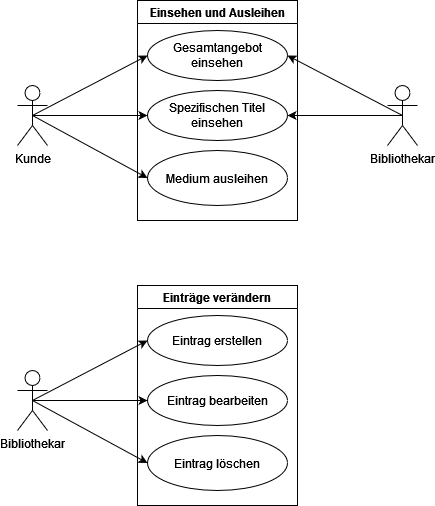
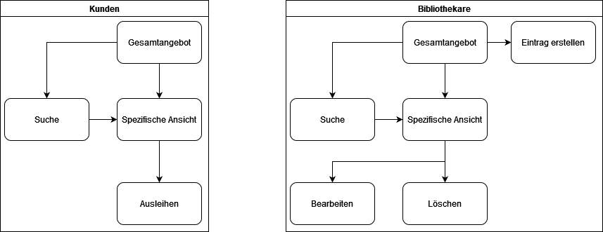
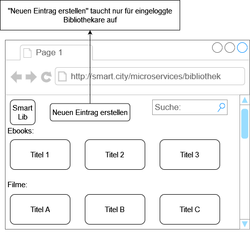
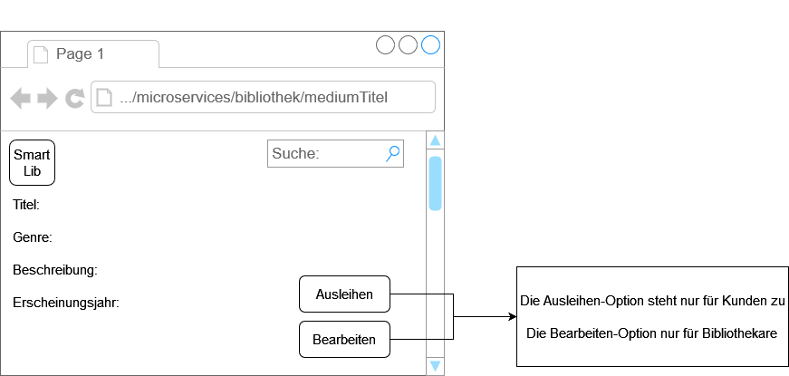
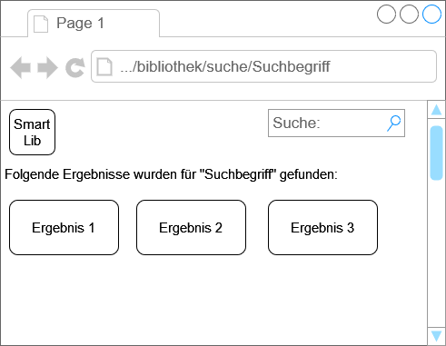
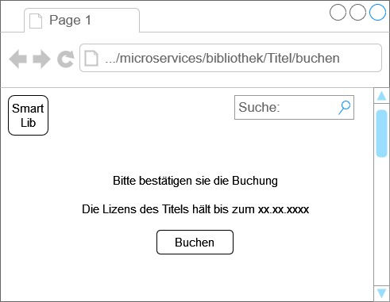
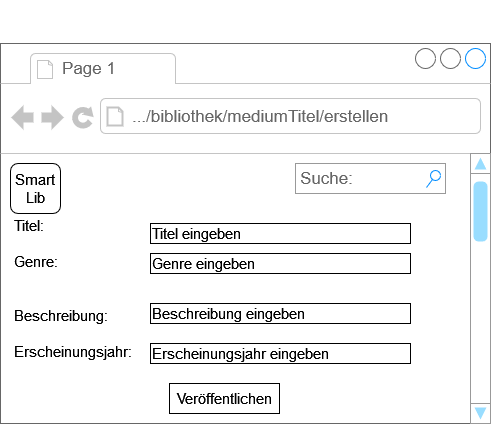
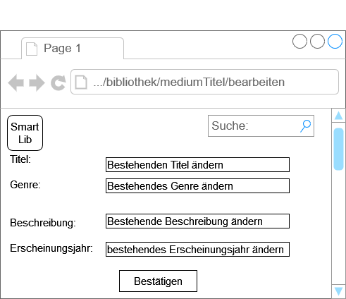
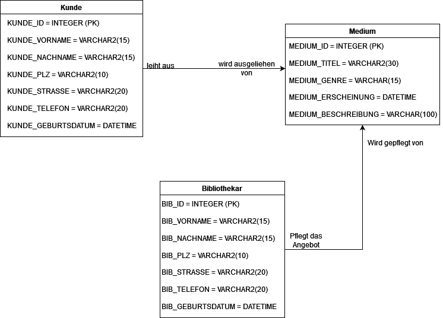
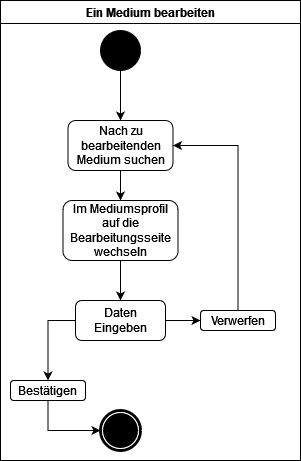

# Bibliothek "Smart Lib"

**Autor:** Oskar Schaubert

## Überblick

- Bei der Smart Lib Bibliothek lassen sich diverse digitale Medien über das Onlineportal ausleihen

## Funktionale Anforderungen

* Akteure:
	- Bibliothekar
	- Kunde

* Use-Case Diagramme_
	

## Anforderungen im Detail

### Finden und Ausleihen

| **Name**| **In meiner Rolle als**...|   ...**möchte ich**...   | ..., **so dass**... | **Erfüllt, wenn**... | **Priorität**   |
|:-----|:----------:|:-------------------|:-------------|:---------|:----------------|
| Gesamtangebot einsehen | Kunde und Bibliothekar | Sämtliche verfügbare Medien einsehen | ich eine ungefähre Einsicht in das Gesamtangebot habe | auf einer Seite eine geordnete Ansicht der Medien, welche aktuell zur verfügung stehen, einsehbar ist. | Must |

| **Name**| **In meiner Rolle als**...|   ...**möchte ich**...   | ..., **so dass**... | **Erfüllt, wenn**... | **Priorität**   |
|:-----|:----------:|:-------------------|:-------------|:---------|:----------------|
| Spezifische Ansicht | Kunde und Bibliothekar | Informationen zu spezifischen Medien genauer einsehen | ich weitere Informationen zu meiner Auswahl bekommen kann | durch klicken eine neue Ansicht geöffnet werden kann, auf der genauere Informationen zu einen Titel stehen wie Erscheinungsjahr, Beschreibung und Author zu sehen sind | Must |

| **Name**| **In meiner Rolle als**...|   ...**möchte ich**...   | ..., **so dass**... | **Erfüllt, wenn**... | **Priorität**   |
|:-----|:----------:|:-------------------|:-------------|:---------|:----------------|
| Suchen | Kunde und Bibliothekar | nach Medien suchen | spezifische Medien nach Name finden kann | Auf den Seiten steht eine Suchleiste zur Verfügung, durch welche alle Medien nach Namen gesucht werden können | Must |

| **Name**| **In meiner Rolle als**...|   ...**möchte ich**...   | ..., **so dass**... | **Erfüllt, wenn**... | **Priorität**   |
|:-----|:----------:|:-------------------|:-------------|:---------|:----------------|
| Ausleihen | Kunde | Medien ausleihen können | ich sie anschauen bzw. durchlesen kann | in der spezifischen Einsicht ein Button gedrückt wird, der das Runterladen der digitalen Medien erlaubt | Must |

### Einträge verändern

| **Name**| **In meiner Rolle als**...|   ...**möchte ich**...   | ..., **so dass**... | **Erfüllt, wenn**... | **Priorität**   |
|:-----|:----------:|:-------------------|:-------------|:---------|:----------------|
| Eintrag erstellen | Bibliothekar | der Bibliothek neue Medien hinzufügen | die Auswahl sich erweitern lässt | Über ein Untermenü kann ein Bibliothekar Daten für ein neues Objekt eingeben. Dieses Objekt wird anschließend der Bibliothek hinzugefügt | Must |

| **Name**| **In meiner Rolle als**...|   ...**möchte ich**...   | ..., **so dass**... | **Erfüllt, wenn**... | **Priorität**   |
|:-----|:----------:|:-------------------|:-------------|:---------|:----------------|
| Eintrag bearbeiten | Bibliothekar | Informationen eines bestehenden Mediums bearbeiten | vorhandene Informationen sich nach belieben verändern lassen | auf der Ansichtsseite eines Mediums durch einen Button in eine Ansicht gewechselt werden kann, in welcher sich jegliche Informationen zu einen Medium sich editieren lassen | Should |

| **Name**| **In meiner Rolle als**...|   ...**möchte ich**...   | ..., **so dass**... | **Erfüllt, wenn**... | **Priorität**   |
|:-----|:----------:|:-------------------|:-------------|:---------|:----------------|
| Eintrag Löschen | Bibliothekar | bestehende Einträge der Bibliothek löschen | nicht mehr gewollte Einträge wieder entfernt werden können | auf der Ansichtsseite eines Mediums durch einen Button sich dieses Medium aus der Bibliothek löschen lässt | Must |

## Graphische Benutzerschnittstelle

### Navigationsdiagramm:
	

### Frontpage:
	
	User-Story: Gesamtangebot einsehen
	
	
### Medien Ansicht:
	
	User-Story: Spezifische Ansicht

### Suche
	
	User-Story: Suchen

### Buchung
	
	User-Story: Ausleihen

### Eintrag erstellen
	
	User-Story: Eintrag erstellen

### Editieren
	
	User-Story: Eintrag bearbeiten & Eintrag löschen

## Datenmodell 

### Physikalisches Datenmodell
	

## Abläufe

### Aktivitätsdiagramm Medium ausleihen
	
	
	
### Aktivitätsdiagramm Medium bearbeiten
	

## Schnittstellen

### URL

http://smart.city/microservices/bibliothek  
http://smart.city/microservices/bibliothek/suche  
http://smart.city/microservices/bibliothek/suche/suchbegriff  
http://smart.city/microservices/bibliothek/mediumTitel  
http://smart.city/microservices/bibliothek/mediumTitel/buchen  
http://smart.city/microservices/bibliothek/mediumTitel/erstellen  
http://smart.city/microservices/bibliothek/mediumTitel/bearbeiten  

### Commands

**Synchronous**

| **Name** | **Parameter** | **Resultat** |
| :------ | :----- | :------ |
| createKunde() | String vorname, String nachname, String plz, String strasse, String telefonnummer, date geburtstag | void |
| deleteKunde() | int id | void |
| createBibliothekar() | String vorname, String nachname, String plz, String strasse, String telefonnummer, date geburtstag | void |
| deleteBibliothekar() | int id | void |
| createMedium | String titel, String genre, date erscheinung, String beschreibung | void |
| deleteMedium() | int id | void |

**Asynchronous**

| **Name** | **Parameter** | **Resultat** |
| :------ | :----- | :------ |
| confirmAusleihen() | int mediumId, int kundenId | void |

### Queries

| **Name** | **Parameter** | **Resultat** |
| :------ | :----- | :------ |
| getAllMediums() | - | medium [] list |
| getAllKunden() | - | kunden [] list |
| getAllBibliothekare() | - | bibliothekare [] list |

## Technische Umsetzung

### Verwendete Technologien

* Frontend:
	- Javascript - React
* Backend:
	- Python - Django
* Datenbank:
	- MySQL

## Glossar

* Medium: 
	- Ein Eintrag in der Bibliothek. Dies Umfasst jegliche Art von ausleihbaren digitalen Medien wie E-Books, digitale Filme und Scans von diversen Magazinen und Zeitungen.

