# Smart Rent

**Autor:** Abdurakhman Vaysert


## Überblick

- Smart Rent ist für das Vermieten von elektro Fahrzeugen zuständig. Unter elektro Fahrzeuge fallen elektro Fahrräder, elektro Roller und elektro Autos.
Die Fahrzeuge sind alle schnell einsehbar und mit wenigen klicks gemietet.


## Funktionale Anforderungen

* Akteure:
  - Mieter: Der Mieter kann sich alle Fahrzeuge anschauen und auswählen, welches Fahrzeug er mieten möchte.
  - Vermieter: Der Vermieter ist dafür zuständig die Fahrzeuge auf der Homepage auszustellen.
* Use-Case Diagramme:<br>
  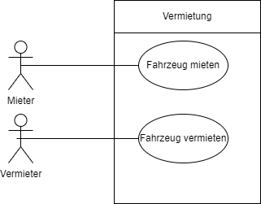
  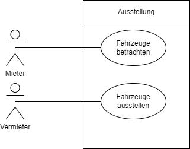
  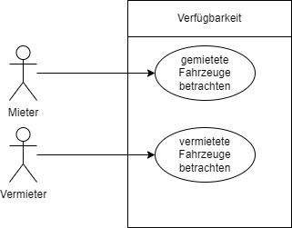


## Anforderungen im Detail

### Mieter User-Stories:

| **Name**| **In meiner Rolle als**...|   ...**möchte ich**...   | ..., **so dass**... | **Erfüllt, wenn**... | **Priorität**   |
|:-----|:----------:|:-------------------|:-------------|:---------|:----------------|
| Fahrzeug betrachten |Mieter|betrachten welche Fahrzeuge zur Verfügung stehen|ich weiß welche Auswahl ich habe | Fahrzeuge betrachtbar sind | Muss |
| Fahrzeug mieten |Mieter| ein Fahrzeug mieten|ich das Fahrzeug benutzen kann| die Bezahlung erfolgreich absgeschlossen wurde | Muss |
| aktuell gemieteten Fahrzeuge betrachten |Mieter| die von mir aktuell gemieteten Fahrzeuge betrachten| ich diese im Vorfeld zurückgeben oder die Mietdauer verlängern kann| das Fahrzeug bei rückgabe wieder zur Verfügung steht oder bei Mietverlängerung bezahlt wird| Muss|

### Vermieter User-Stories:

| **Name**| **In meiner Rolle als**...|   ...**möchte ich**...   | ..., **so dass**... | **Erfüllt, wenn**... | **Priorität**   |
|:-----|:----------:|:-------------------|:-------------|:---------|:----------------|
| Fahrzeug ausstellen |Vermieter| ein Fahrzeug als Mietobjekt zur Ausstellung stellen| für das Fahrzeug gewirbt wird | Das Fahrzeug zur Verfügung steht und das Fahrzeug angezeigt wird | Muss |
| vermietete Fahrzeuge betrachten |Vermieter| eine Übersicht von den vermieteten Fahrzeugen haben | ich weiß, welche Fahrzeuge vermietet sind und wer diese gemietet hat| alle vermieteten Fahrzeuge und deren Mieter angezeigt werden| Muss |

## Graphische Benutzerschnittstelle

### Auswahlmöglichkeiten der Fahrzeuge für den Mieter:
 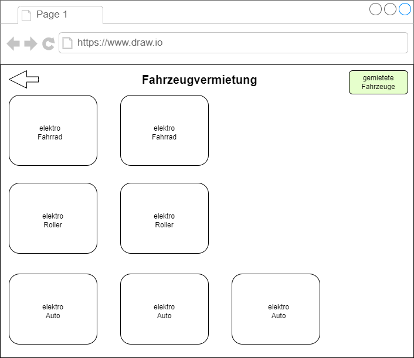
 [Fahrzeuge betrachten](#mieter-user-stories)
### Betrachten eines Fahrzeugs vom Sicht des Mieters:
 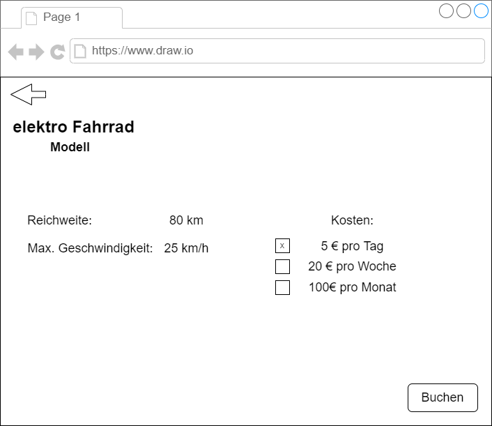
 [Fahrzeuge betrachten](#mieter-user-stories) <br>
 [Fahrzeug mieten](#mieter-user-stories)
### Betrachten der gemieteten Fahrzeuge:
 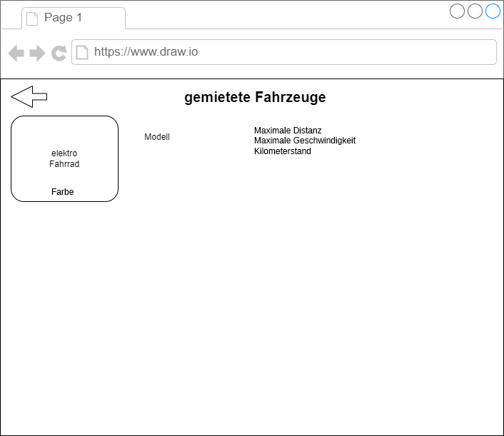
 [aktuell gemieteten Fahrzeuge betrachten](#mieter-user-stories)
### Fahrzeugauswahl betrachten vom Sicht des Vermieters:
 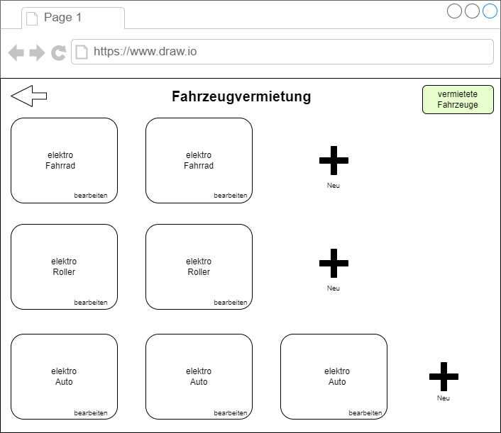
 [Fahrzeug ausstellen](#vermieter-user-stories)
### Fahrzeug bearbeiten oder neues Hinzufügen vom Sicht des Vermieters:
 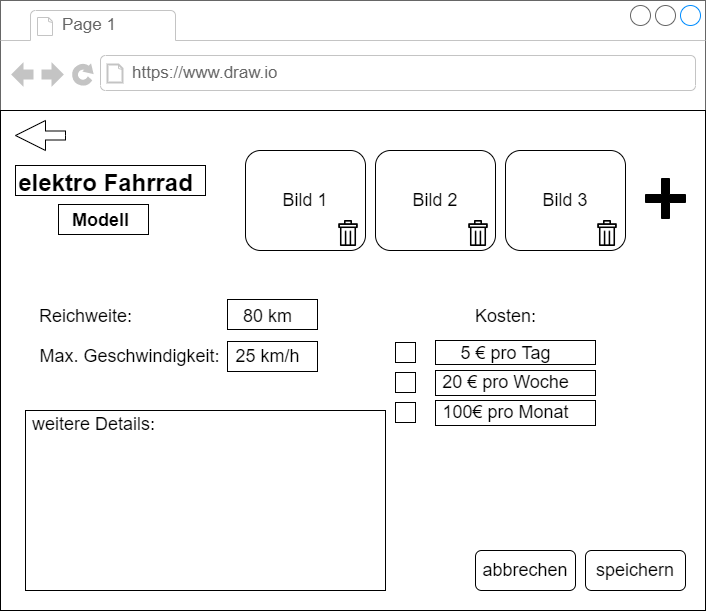
 [Fahrzeug ausstellen](#vermieter-user-stories)
### Betrachten der vermieteten Fahrzeuge:
 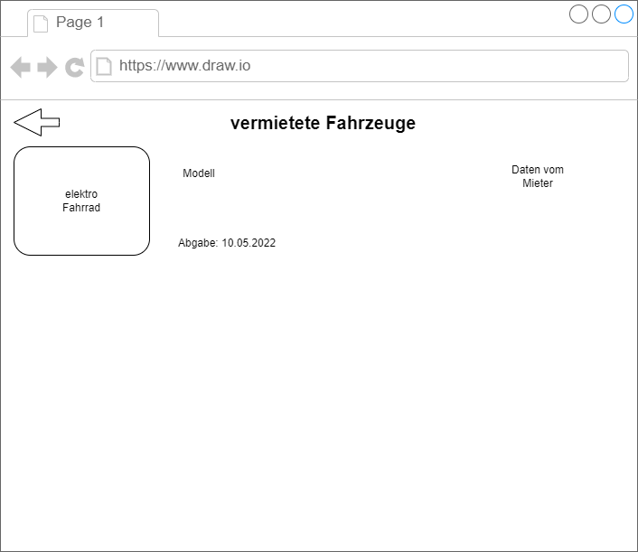
 [vermietete Fahrzeuge betrachten](#vermieter-user-stories)

### Zustandsdiagramm:
 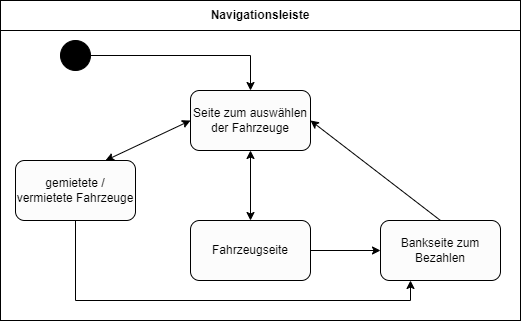


## Datenmodell 

### physikalisches Datenmodell
 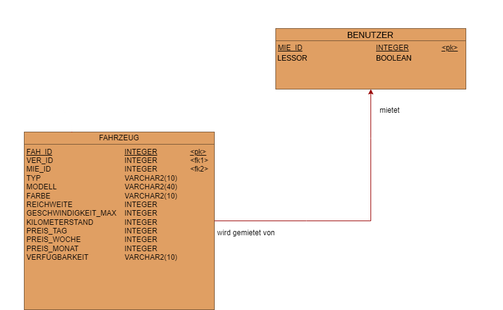
### ER Datenmodell
 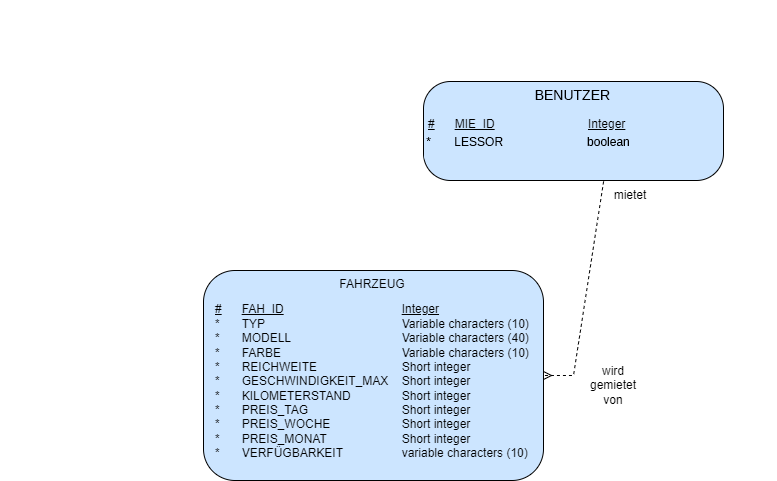

## Abläufe

### Aktivitätsdiagramm für den Ablauf sämtlicher Use Cases
 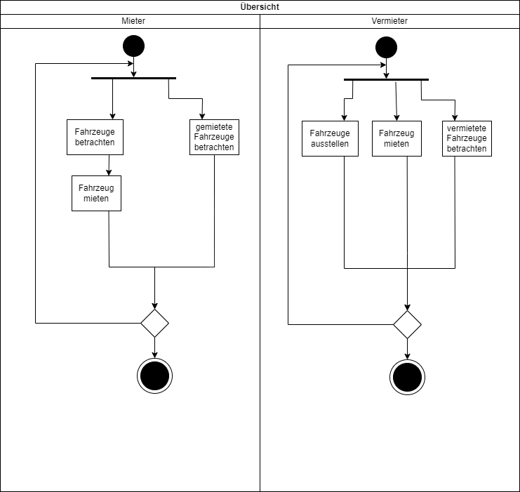
### Aktivitätsdiagramm für das Mieten eines Fahrzeugs
 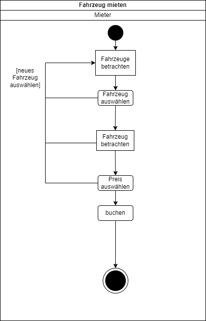

### Ablauf der Kommunikation vom Mieten eines Fahrzeugs als Aktivitätsdiagramm
 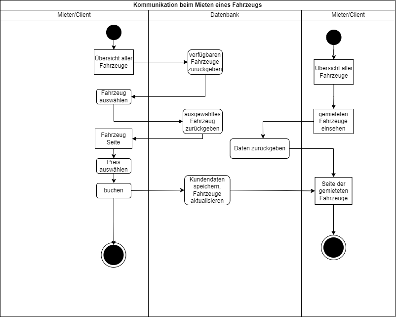


## Schnittstellen

### URL

#### Neuen Benutzer anlegen
POST
```
{
  "firstname": "Abdurakhman"
  "lastname": "Vaysert"
  "salution": "Herr"
  "birthdate": "03.11.1996"
  "address": "Musterstraße 3"
  "city": "Minden"
  "zipcode": "32425"
  "tel": "0123456789"
}
public boolean register(String firstname,
                        String lastname,
                        String salution,
                        Date birthdate,
                        String address,
                        String city,
                        int zipCode,
                        int tel
                        ) {return boolean;}
```

#### Accountdaten holen
GET http://localhost:8080/fahrzeugvermietung/
```
public Customer getCustomer(Cookie cookie){return customer;}
```

#### Mietbare Fahrzeuge laden
GET http://localhost:8080/fahrzeugvermietung/
```
public Vehicle getContractsAllAvailableVehicles(){return vehicleList;}

{ "vehicles": [
    {"vehicle_id": "1"
    "type": "car"
    "vehicle_modell": "BMW i3"
    "vehicle_color": "black"
    "vehicle_distance": "250"
    "vehicle_max_speed": "150"
    "vehicle_mileage": "13030"
    "price_day": "20"
    "price_week": "80"
    "price_month": "300"},

    {"vehicle_id": "2"
    "type": "car"
    "vehicle_modell": "BMW i8"
    "vehicle_color": "black"
    "vehicle_distance": "500"
    "vehicle_max_speed": "250"
    "vehicle_mileage": "10030"
    "price_day": "40"
    "price_week": "160"
    "price_month": "600"}
  ] 
}
```

#### Fahrzeug hinzufügen
POST http://localhost:8080/fahrzeugvermietung/neues_fahrzeug
```
{
  "vehicle_id": "1"
  "type": "car"
  "vehicle_modell": "BMW i3"
  "vehicle_color": "black"
  "vehicle_distance": "250"
  "vehicle_max_speed": "150"
  "vehicle_mileage": "13030"
  "price_day": "20"
  "price_week": "80"
  "price_month": "300"
}
public boolean createVehicle( int vehicleID,
                              int lessorID,
                              String type,
                              String vehicleModell,
                              String vehicleColor,
                              int vehicleDistance,
                              int vehicleMaxSpeed,
                              int vehicleMileage,
                              int priceDay,
                              int priceWeek,
                              int priceMonth
                              ) {return boolean;}
```

#### Mietvertrag erstellen
POST http://localhost:8080/fahrzeugvermietung/fahrzeug/id?={id}
```
{
  "customer_id": "11"
  "vehicle_id": "3"
  "price_option": "10"
}
public boolean createRentContract(int customerID,
                                  int vehicleID,
                                  int priceOption
                                  ) {return boolean;}

rabbitMQ:
  public void sendPaymentData(int customerID,
                              int priceToPay,
                              int smartRentID
                              ){}
```

#### Mietvertrag bearbeiten
POST http://localhost:8080/fahrzeugvermietung/gemietete_fahrzeuge/id?={id}
```
{
  "customer_id": "11"
  "vehicle_id": "3"
  "price_option": "10"
}
public boolean changeRentContract(int customerID,
                                  int vehicleID,
                                  int priceOption
                                  ) {return boolean;}

rabbitMQ:
  public void sendPaymentData(int customerID,
                              int priceToPay,
                              int smartRentID
                              ){}
```

#### Rechnung löschen
DELETE http://localhost:8080/fahrzeugvermietung/gemietete_fahrzeuge/id?={id}
```
{
  "customer_id": "11"
  "vehicle_id": "3"
}
public boolean deleteOrder(int customerID, int vehicleID){return boolean;}
```

#### Meine gemieteten Fahrzeuge anzeigen
DELETE http://localhost:8080/fahrzeugvermietung/gemietete_fahrzeuge
```
{
  "customer_id": "11"
}
public Vehicle getContractsMyRentVehicles()(int customerID){return listMyRentVehicles;}

{ "vehicles": [
    {"vehicle_id": "1"
    "type": "car"
    "vehicle_modell": "BMW i3"
    "vehicle_color": "black"
    "vehicle_distance": "250"
    "vehicle_max_speed": "150"
    "vehicle_mileage": "13030"
    "price_day": "20"
    "price_week": "80"
    "price_month": "300"
    "return_date": "20.08.2022"},

    {"vehicle_id": "2"
    "type": "car"
    "vehicle_modell": "BMW i8"
    "vehicle_color": "black"
    "vehicle_distance": "500"
    "vehicle_max_speed": "250"
    "vehicle_mileage": "10030"
    "price_day": "40"
    "price_week": "160"
    "price_month": "600"
    "return_date": "20.08.2022"}
  ] 
}
```

#### Alle vermieteten Fahrzeuge anzeigen
DELETE http://localhost:8080/fahrzeugvermietung/vermietete_fahrzeuge
```
{
  "customer_id": "11"
}
public Vehicle getContractsMyRentVehicles()(int customerID){return listAllRentVehicles;}

{ "vehicles": [
    {"vehicle_id": "1"
    "type": "car"
    "vehicle_modell": "BMW i3"
    "vehicle_color": "black"
    "vehicle_distance": "250"
    "vehicle_max_speed": "150"
    "vehicle_mileage": "13030"
    "return_date": "20.08.2022"
    "customer":{ 
      "firstname": "Abdurakhman"
      "lastname": "Vaysert"
      "salution": "Herr"
      "birthdate": "03.11.1996"
      "address": "Musterstraße 3"
      "city": "Minden"
      "zipcode": "32425"
      "tel": "0123456789"}
    },

    {"vehicle_id": "2"
    "type": "car"
    "vehicle_modell": "BMW i8"
    "vehicle_color": "black"
    "vehicle_distance": "500"
    "vehicle_max_speed": "250"
    "vehicle_mileage": "10030"
    "return_date": "20.08.2022"
    "customer":{ 
      "firstname": "Abdurakhman"
      "lastname": "Vaysert"
      "salution": "Herr"
      "birthdate": "03.11.1996"
      "address": "Musterstraße 3"
      "city": "Minden"
      "zipcode": "32425"
      "tel": "0123456789"}
    }
  ] 
}
```

### Commands

**Synchronous**

|| **Name** | **Parameter** | **Resultat** |
|:-| :------ | :----- | :------ |
| POST | createCustomer() | int customerID , String lastname, String firstname, String address, String salution, String city, int zipcode, int tel, Date birthdate | boolean registered |
|DELETE| deleteOrder() | int customerID, vehicleID | boolean deleted |
|POST| createVehicles()| int vehicleID, int lessorID, String type, String vehicleModell, String vehicleColor, int vehicleDistance, int vehicleMaxSpeed, int vehicleMileage, int priceDay, int priceWeek, int priceMonth| boolean created|


**Asynchronous**

|| **Name** | **Parameter** | **Resultat** |
|:-| :------ | :----- | :------ |
|POST| createRentContract() | int customerID, int vehicleID, int priceOption | boolean result |
|PUT| changeRentContract() | int customerID, int vehicleID | boolean result |
|| changeVehicleRentable() | int customerID, int vehicleID| |
|rabbitMQ| sendPaymentData()| int customerID, int priceToPay, int smartRentID| boolean result|
|rabbitMQ| getBillPaid()| int customerID, int smartRentID| boolean result|

### Queries

|| **Name** | **Parameter** | **Resultat** |
|:-| :------ | :----- | :------ |
|GET| getContractsMyRentVehicles() | int customerID | Contract [] listMyRentVehicles |
|GET| getContractsAllRentVehicles() | - | Contract [] listAllRentVehicles |
|GET| getContractsAllAvailableVehicles() | - | Contract [] listAllAvailableVehicles |

### Dependencies

#### RPC

| **Service** | **Funktion** | **Routing Key** | Query type |
| :------ | :----- | :----- | :----- |
| Send Payment Data | sendPaymentData() | bank.payment.received | Senden |
| Authenticate Payment | getBillPaid() | bank.payment.status.< service > |Hören |
 | Customer Created Service | createCustomer() | portal.account.created | Hören |
 | Customer Deleted Service | deleteCustomer() | portal.account.deleted | Hören |


## Technische Umsetzung

### Fehlerbehandlung 

- ID des Vermieters wird bei der Bank von Marcel nicht erkannt / es existieren keine Daten unter dieser ID
  - Die übergebene Daten von Smart City unverändert speichern, damit solche Fehler nicht passieren
- Die Kommunikation zwischen Microservices (z.B. das Übersenden vom Mieter zur Bankseite zum Bezahlen der Rechnung) funktioniert nicht 
  - richtig absprechen wie die Kommunikation funktionieren soll und gegenseitig helfen
- Datenbankserver ist nicht erreichbar, somit ist die komplette Webseite nutzlos
- Übergebene Daten sind vom falschen Typ (z.B. gewollt float, aber man bekommt einen int wert)
  - auch hier richtig absprechen, wie die Kommunikation ablaufen soll


### Verwendete Technologien

* Vue.js
* SpringBoot
* postgreSql
