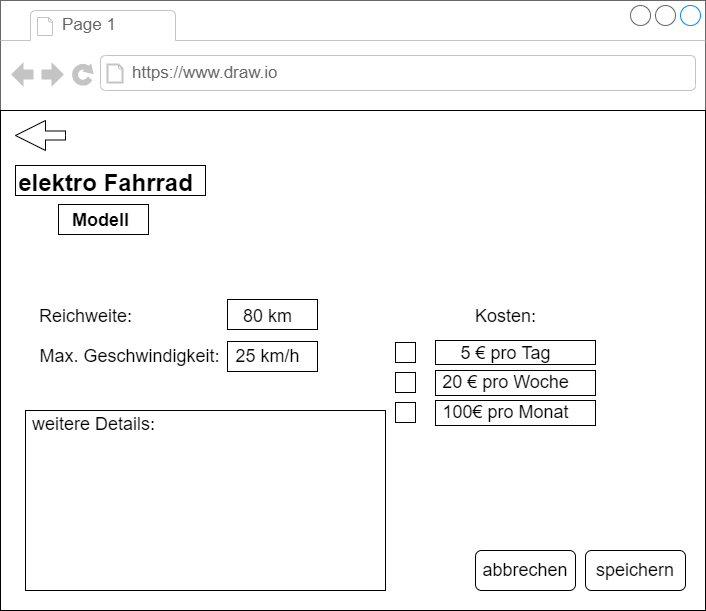

# Autoverleih

**Autor:** Abdurakhman Vaysert

## Überblick

- Die Fahrzeugvermietung ist für das Vermieten von elektro Fahrezeugen zuständig. Unter elektro Fahrzeuge fallen elektro Fahrräder, elektro Roller und elektro Autos.
- TODO: Konzeptionelles Analyseklassendiagramm (logische Darstellung der Konzepte der Anwendungsdomäne)

## Funktionale Anforderungen

* Akteure:
  - Mieter: Der Mieter kann sich alle Fahrzeuge anschauen und auswählen, welches Fahrzeug er mieten möchte.
  - Vermieter: Der Vermieter ist dafür zuständig die Fahrzeuge auf der Homepage auszustellen.
* Use-Case Diagramme:
 
  
  
  
* Strukturierung der Diagramme in funktionale Gruppen
* Akteure sowie andere Begriffe der implementierten Fachdomäne definieren
* Begriffe konsistent in der Spezifikation verwenden  
* Begriffe im Glossar darstellen

## Anforderungen im Detail

- TODO: Sicherheit: Misuse-Stories formulieren

#### Mieter User-Stories:

| **Name**| **In meiner Rolle als**...|   ...**möchte ich**...   | ..., **so dass**... | **Erfüllt, wenn**... | **Priorität**   |
|:-----|:----------:|:-------------------|:-------------|:---------|:----------------|
| Fahrzeug anschauen |Mieter|anschauen welche Fahrzeuge zur Verfügung stehen|ich weiß welche Auswahl ich habe | Fahrzeuge betrachtbar sind | Muss |
| Fahrzeug mieten |Mieter| ein Fahrzeug mieten|ich das Fahrzeug benutzen kann| die Bezahlung erfolgreich absgeschlossen wurde | Muss |
| aktuell gemietete Fahrzeuge betrachten |Mieter| die von mir aktuell gemietete Fahrzeuge betrachten| ich diese im Vorfeld zurückgeben oder die Mietdauer verlängern kann| das Fahrzeug bei rückgabe wieder zur Verfügung steht oder bei Mietverlängerung bezahlt wird| Muss|

#### Vermieter User-Stories:

| **Name**| **In meiner Rolle als**...|   ...**möchte ich**...   | ..., **so dass**... | **Erfüllt, wenn**... | **Priorität**   |
|:-----|:----------:|:-------------------|:-------------|:---------|:----------------|
| Fahrzeug ausstellen |Vermieter| ein Fahrzeug als Mietobjekt zur Ausstellung stellen| für das Fahrzeug gewirbt wird | Das Fahrzeug zur Verfügung steht und das Fahrzeug angezeigt wird | Muss |
| vermietete Fahrzeuge betrachten |Vermieter| eine Übersicht von den vermieteten Fahrzeugen haben | ich weiß, welche Fahrzeuge vermietet sind und wer diese gemietet hat| alle vermieteten Fahrzeuge und deren Mieter angezeigt werden| Muss |

## Graphische Benutzerschnittstelle

### Auswahlmöglichkeiten der Fahrzeuge für den Mieter
 
### Betrachten eines Fahrzeugs vom Sicht des Mieters
 
### Betrachten der gemieteten Fahrzeuge
 
### Fahrzeugauswahl betrachten vom Sicht des Vermieters
 
### Fahrzeug bearbeiten oder neues Hinzufügen vom Sicht des Vermieters
 
### Betrachten der vermieteten Fahrzeuge
 
- Screens mit Überschrift kennzeichnen, die im Inhaltsverzeichnis zu sehen ist
- Unter den Screens darstellen (bzw. verlinken), welche User Stories mit dem Screen abgehandelt werden
- Modellierung der Navigation zwischen den Screens der GUI-Mockups als Zustandsdiagramm
### Zustandsdiagramm
 
- Mockups für unterschiedliche Akteure

## Datenmodell 

- Begriffe im Glossar darstellen
- Modellierung des physikalischen Datenmodells 
  - RDBMS: ER-Diagramm bzw. Dokumentenorientiert: JSON-Schema
### physikalisches Datenmodell
 
### ER Datenmodell
 

## Abläufe

### Aktivitätsdiagramm für den Ablauf sämtlicher Use Cases
 
- Aktivitätsdiagramme für relevante Use Cases
### Aktivitätsdiagramm für das Mieten eines Fahrzeugs
 
- Aktivitätsdiagramm mit Swimlanes sind in der Regel hilfreich 
  für die Darstellung der Interaktion von Akteuren der Use Cases / User Stories
- Abläufe der Kommunikation von Rechnerknoten (z.B. Client/Server)
  in einem Sequenz- oder Aktivitätsdiagramm darstellen
### Ablauf der Kommunikation vom Mieten eines Fahrzeugs als Aktivitätsdiagramm
 
- Modellieren Sie des weiteren die Diagramme, die für das (eigene) Verständnis des
  Softwaresystems hilfreich sind. 

## Schnittstellen

- Schnittstellenbeschreibung (API), z.B. mit OpenAPI 
- Auflistung der nach außen sichtbaren Schnittstelle des Microservices. Über welche Schnittstelle kann z.B. der Client den Server erreichen?
- In Event-gesteuerten Systemen ebenfalls die Definition der Ereignisse und deren Attribute
- Aufteilen in Commands, Events, Queries
* Abhängigkeiten: Liste mit Kommunikationsabhängigkeiten zu anderen Microservices

**Beispiel:**

### URL

http://smart.city/microservices/autoverleih

### Commands

**Synchronous**

|| **Name** | **Parameter** | **Resultat** |
|:-| :------ | :----- | :------ |
| POST | createCustomer() | int mieterID , String lastname, String firstname, String address, int tel, int birthdate | int result |
|DELETE| deleteOrder() | int mieterID, fahrzeugID | int result |
|POST| createVehicles()| int fahrzeugID, int vermieterID, String type, String vehicleModell, String vehicleColor, int vehicleDistance, int vehicleMaxSpeed, int vehicleMileage, int priceDay, int priceWeek, int priceMonth| int result|
|POST| sendPaymentData()| int mieterID, int priceToPay, int fahrzeugvermietungID| int result|

**Asynchronous**

|| **Name** | **Parameter** | **Resultat** |
|:-| :------ | :----- | :------ |
|POST| createRentContract() | int mieterID, fahrzeugID | int result |
|PUT| changeRentContract() | int mieterID, fahrzeugID | int result |
|PUT| changeVehicleRentable() | int fahrzeugID, int mieterID| int result|
|GET| getBillPaid()| int mieterID, int fahrzeugvermietungID| int result|

### Events

**Customer event channel**
TODO
| **Name** | **Payload** | 
| :------ | :----- | 
| Customer Authorized | int id |
| Customer Deleted | int id |

**Contract event channel**
TODO
| **Name** | **Payload** | 
| :------ | :----- | 
| Contract Received | int id |
| Contract Deleted | int id |

### Queries

|| **Name** | **Parameter** | **Resultat** |
|:-| :------ | :----- | :------ |
|GET| getContractsMyRentVehicles() | int mieterID | Contract [] listMyRentVehicles |
|GET| getContractsAllRentVehicles() | - | Contract [] listAllRentVehicles |
|GET| getContractsAllAvailableVehicles() | - | Contract [] listAllAvailableVehicles |

### Dependencies

#### RPC

| **Service** | **Funktion** |
| :------ | :----- | 
| Authorization Service | authenticateUser(), sendPaymentData(), getBillPaid() |

## Technische Umsetzung

### Softwarearchitektur

- Darstellung von Softwarebausteinen (Module, Schichten, Komponenten)

Hier stellen Sie die Verteilung der Softwarebausteine auf die Rechnerknoten dar. Das ist die Softwarearchitektur. Zum Beispiel Javascript-Software auf dem Client und Java-Software auf dem Server. In der Regel wird die Software dabei sowohl auf dem Client als auch auf dem Server in Schichten dargestellt.

* Server
  * Web-Schicht
  * Logik-Schicht
  * Persistenz-Schicht

* Client
  * View-Schicht
  * Logik-Schicht
  * Kommunikation-Schicht

Die Abhängigkeit ist bei diesen Schichten immer unidirektional von "oben" nach "unten". Die Softwarearchitektur aus Kapitel "Softwarearchitektur" ist demnach detaillierter als die Systemübersicht aus dem Kapitel "Systemübersicht". Die Schichten können entweder als Ganzes als ein Softwarebaustein angesehen werden. In der Regel werden die Schichten aber noch weiter detailliert und in Softwarebausteine aufgeteilt. 

### Entwurf

- Detaillierte UML-Diagramme für relevante Softwarebausteine

### Fehlerbehandlung 

#### Mögliche Fehler:
- VermieterID wird bei der Bank von Marcel nicht erkannt / es existieren keine Daten unter dieser ID
- Das Übersenden vom Mieter zur Bankseite zum Bezahlen der Rechnung funktioniert nicht
- Datenbankserver ist nicht erreichbar, somit ist die komplette Webseite nutzlos
- Kommunikation zwischen Banksystem und Fahrzeugvermietung funktioniert nicht
- Übergebene Daten sind vom falschen Typ (z.B. gewollt float, aber man bekommt einen int wert)
* Fehlercodes / IDs sind hilfreich
* Nicht nur Fehler technischer Art ("Datenbankserver nicht erreichbar") definieren, sondern auch fachliche Fehler wie "Kunde nicht gefunden", "Nachricht wurde bereits gelöscht" o.ä. sind relevant. 

### Validierung

* Relevante (Integrations)-Testfälle, die aus den Use Cases abgeleitet werden können
* Testfälle für 
  - Datenmodell
  - API
  - User Interface
* Fokussieren Sie mehr auf Integrationstestfälle als auf Unittests
* Es bietet sich an, die IDs der Use Cases / User Stories mit den Testfällen zu verbinden,
  so dass erkennbar ist, ob Sie alle Use Cases getestet haben.

### Verwendete Technologien

* Vue.js
* SpringBoot
* postgreSql
