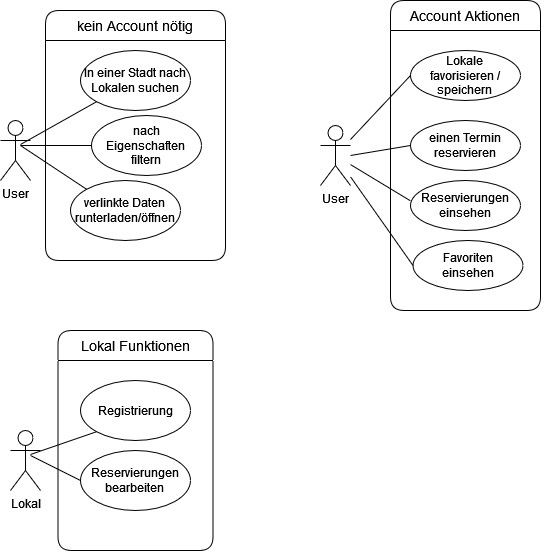
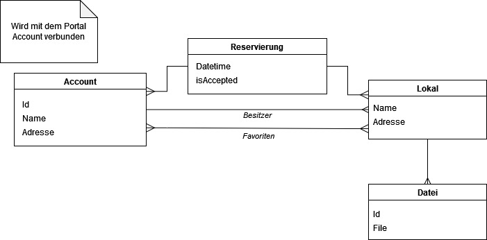

# Local Finder

**Autor:** René Braun

## Überblick

Local Finder bietet den Usern die Möglichkeit nach Freizeitaktivitäten in der Umgebung zu suchen. Dabei kann man optional noch den Typ angeben, beispielsweise wenn man nach Bars oder Restaurants in der Nähe finden möchte. Dabei kann man zusätzlich einen Standort angeben. Bei den Suchergebnissen werden dann Name, Entfernung und Öffungszeiten angezeigt. Nachdem Auswählen wird dann noch zusätzlich eine Beschreibung angezeigt und eventuell eine Website und eine Speisekarte verlinkt, sollten diese verfügbar sein.

## Funktionale Anforderungen

* Use-Case Diagramme

## Anforderungen im Detail

**User Stories**

| **Name** | **Als** | **möchte ich** | **so dass** | **Akzeptanz** |
| :------- | :------ | :------------- | :---------- | :------------ |
| Suchfunktion  | User    | nach Aktivitäten suchen       | ich rausfinden kann, welche Lokale es gibt     | Eine Liste mit Ergebnissen wird angezeigt |
| Filter        | User    | die Suche filtern             | nur im bestimmtem Umfeld gesucht wird          | Nur Ergebnisse aus dem Umkreis angezeigt werden |
| Herunterladen | User    | verlinkte Dateien runterladen | sie auf meinem Gerät gespeichert sind          | Die jeweilige PDF wurde auf dem Gerät heruntergeladen |
| Favorisieren  | User    | Lokale favorisieren / merken  | ich sie jederzeit, auch offline, einsehen kann | Eine Liste von gemerkten Lokalen befindet sich auf der App |
| Reservieren   | User    | einen Termin reservieren      | ich einen Termin mit dem Lokal ausmachen kann  | Die Reservierung wurde an das Lokal weitergeleitet |
| Lokal registrieren       | Lokal | möchte ich mein Lokal registrieren und den Account erstellen | User Reservierungen vornehmen können | Lokaldaten wurden angegeben |
| Reservierung bearbeiten  | Lokal | eingegangene Reservierungen annehmen/ablehenen | beim User eine Antwort vorliegt | Die Reservierung wird nicht mehr angezeigt und der User hat eine Bestätigung per E-Mail erhalten |

## Graphische Benutzerschnittstelle

- GUI-Mockups

## Datenmodell 

- physikalisches Datenmodell

## Abläufe

- Aktivitätsdiagramm für den Ablauf sämtlicher Use Cases

- Aktivitätsdiagramme für relevante Use Cases

- Abläufe der Kommunikation von Rechnerknoten

## Schnittstellen

- OpenStreetMap: OverpassAPI wird hier zur Suche von Lokalen genutzt

### URL

* http://smart.city/microservice/localfinder/

* http://smart.city/microservice/localfinder/favorites

* http://smart.city/microservice/localfinder/local/id

* http://smart.city/microservice/localfinder/search?destination=""&startingLocation=""&area=

* http://smart.city/microservice/localfinder/reservations

### Commands

**Synchronous**

| **Name** | **Parameter** | **Resultat** |
| :------- | :------------ | :----------- |
| SearchRequest() | String destination, String startingLocation, int area | JSON [] Location |
| downloadFile()  | int locationId, String filename                       | File file |

**Asynchronous**

| **Name** | **Parameter** | **Resultat** |
| :------- | :------------ | :----------- |
| requestReservation() | int userId, Date date, int localId                      | - |
| registerLocal()      | JSON location{user.id, location.name, location.address} | - |

### Events

**User event channel**

| **Name** | **Payload** |
| :------- | :---------- |
| Toggle Favorite | int userId, int localId |

**Local event channel**

| **Name** | **Payload** |
| :------- | :---------- |
| Accept  Reservation | int reservationId |
| Decline Reservation | int reservationId |

**Stadtverwaltung event channel**

| **Name** | **Payload** |
| :------- | :---------- |
| Authorize Location | int localId |

### Queries

| **Name** | **Parameter** | **Resultat** |
| :------- | :------------ | :----------- |
| getReservations() | int localId | JSON [] reservations  |
| getFavorites()    | int userId | JSON [] locations |

### Dependencies

#### RPC

| **Service** | **Funktion** |
| :---------- | :----------- |
| Fetch Account from Portal | fetchAccount() |

#### Event-Subscriptions

| **Service** | **Funktion** |
| :---------- | :----------- |
| Sending Local authentication request | local.auth.create |
| Listening on Local authentication status | local.auth.status |

## Technische Umsetzung

### Softwarearchitektur

### Entwurf

- UML-Diagramme eines Back End Bausteins

### Fehlerbehandlung 

* Datenbank nicht erreichbar
  - PSQLException: Passwort-Authentifizierung fehlgeschlagen, falsches
    Passwort oder Username für User der Datenbank in application.yml Datei
    angegeben
* HTTP Status 500 IllegalStateException
  - unerwartete Feher auf der Serverseite
* HTTP Status 400 Bad Request
  - Anfrage ist Fehlerhaft 

### Validierung

* Postman wird zum Testen der REST API verwendet

### Verwendete Technologien

* Vue.js mit router und axios
* flask mit sqlalchemy, pika
* postgreSql 
