# Stadtverwaltung

**Autor:** Vadim Balysev


## Überblick


- Damit alles schneller und reibungsloser läuft, hat die Stadtverwaltung sich ein Konzept ausgedacht, dass man Kinder Online in eine Warteliste eintragen kann für Schulen.
  So ähnlich läuft es dann auch mit den Vereinen ab, wobei man hier noch bestimmte voraussetzungen Erfüllen muss.
- Konzeptionelles Analyseklassendiagramm (logische Darstellung der Konzepte der Anwendungsdomäne)


## Funktionale Anforderungen


* Akteure:
  - Verwaltung: Kümmert sich um die eingehenden Anträge und das Verwalten des Services
  - Nutzer: kann Anträge stellen für Vereine, Schulen und Einsehen der Übersichten 

* Use-Case Diagramme

### Use-Case Nutzer
 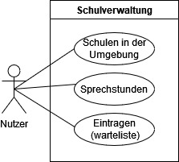
 
 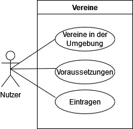

### Use-Case Verwaltung
 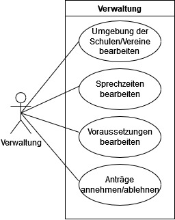

* Strukturierung der Diagramme in funktionale Gruppen
* Akteure sowie andere Begriffe der implementierten Fachdomäne definieren 
* Begriffe konsistent in der Spezifikation verwenden  
* Begriffe im Glossar darstellen

## Anforderungen im Detail


**Nutzer User-Stories für Schulverwaltung**

| **Name**| **Als** | **möchte ich** | **so dass** | **Akzeptanz** |
| :-------| :------ | :----- | :------ | :-------- |
| Schulen ansehen | Nutzer | einsehen welche Schulen es in der Umgebung gibt | ich informationen erhalte für welche ich mich entscheide | Eine Liste von möglichen Schulen |
| Sprechstunden ansehen | Nutzer | einsehen, wann man ein zoom meeting vereinbaren kann | ich informationen erhalte für welche ich mich entscheide | Uhrzeiten mit den möglichen Sprechstunden |
| Eintragen in Wartelisten | Nutzer | mich in eine Warteliste eintragen | ich mein Kind auf die gewünschte Schule schicken kann | alle nötigen Daten angeben mit Dokumenten, für die Einreihung in eine Warteliste |

**Verwaltung User-Stories für Schulverwaltung**

| **Name**| **Als** | **möchte ich** | **so dass** | **Akzeptanz** |
| :------ | :------ | :----- | :------ | :-------- |
| Schulen ansehen | Verwaltung | die Schulen in der Umgebung bearbeiten | ich die Liste immer aktuell halte | bearbeitung der Liste zum ergänzen oder löschen von Schulen |
| Sprechstunden ansehen | Verwaltung | die Zeiten für die Sprechstunden anpassen | ich die Zeiten immer aktuell halte | anpassen der Zeiten |
| Eintragen in Wartelisten | Verwaltung | einsehen welche Anträge angekommen sind | ich die gewünschten Kinder, wenn Platz verfügbar ist in die Schulen aufnehmen kann | Annahmen von Kindern bei genügend Platz  |

**Nutzer User-Stories für Vereine**

| **Name**| **Als** | **möchte ich** | **so dass** | **Akzeptanz** |
| :------ | :------ | :----- | :------ | :-------- |
| Vereine ansehen | Nutzer | einsehen welche Vereine es in der Umgebung schon gibt | ich eine Übersicht habe  | Eine Liste von möglichen Vereine |
| Voraussetzungen ansehen | Nutzer | einsehen, welche Kriterien erfüllt sein müssen | ich einen Verein Gründen darf | alle nötigen Informationen zum Gründen von einem Verein |
| Eintragen in Wartelisten | Nutzer | meinen Verein in eine Warteliste eintragen | ich meinen Verein registrieren kann | alle nötigen Daten angeben mit Dokumenten, für die Einreihung in eine Warteliste |

**Verwaltung User-Stories für Vereine**

| **Name**| **Als** | **möchte ich** | **so dass** | **Akzeptanz** |
| :------ | :------ | :----- | :------ | :-------- |
| Vereine ansehen | Verwaltung | die Vereine in der Umgebung bearbeiten | ich die Liste immer aktuell halte  | bearbeitung der Liste zum ergänze oder löschen von Vereinen |
| Voraussetzungen bearbeiten | Verwaltung | die Voraussetungen anpassen können | man immer die aktuellen Voraussetzungen hat | Alle nötigen Informationen zum Gründen von einem Verein |
| Warteliste ansehen und bearbeiten | Verwaltung | einsehen welche Anträge angekommen sind | ich diese bearbeiten kann | Eine liste der eingetragenen Vereine zum an oder ablehnen |

**Fehlereingaben**

| **Name**| **Als** | **möchte ich** | **so dass** | **Akzeptanz** |
| :------ | :------ | :----- | :------ | :-------- |
| Fehler bei nicht ausgefülltem Feld | Nutzer | bei Fehleingabe die Lösung angezeigt bekommen | ich weiß warum es zum Fehler kam | Lösung wird angezeigt |


**Beispiel**

| **Name**| **In meiner Rolle als**...|   ...**möchte ich**...   | ..., **so dass**... | **Erfüllt, wenn**... | **Priorität**   |
|:-----|:----------:|:-------------------|:-------------|:---------|:----------------|
| Lernen  |Benutzer| bei Fehleingabe die Lösung angezeigt bekommen|ich lernen kann| Lösung wird angezeigt | Muss |

## Graphische Benutzerschnittstelle

### Stadtverwaltung
 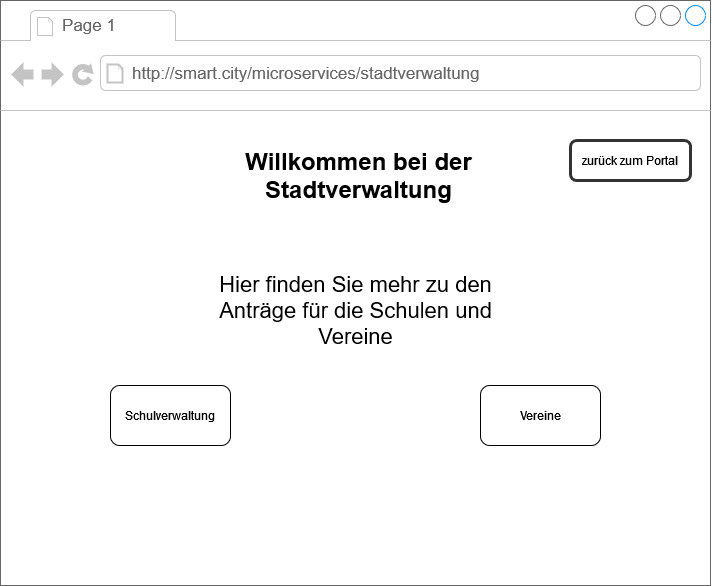
### Startseite für Schulverwaltung
 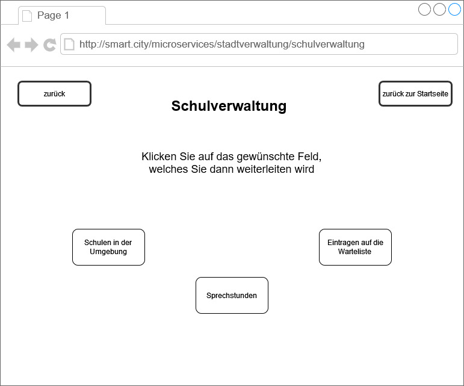
### Sprechstunden
 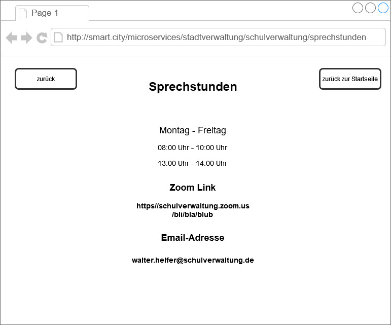
### Eintrag auf die Warteliste für Vereine
 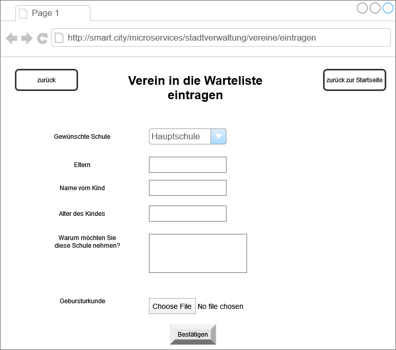
### Startseite für Vereine
 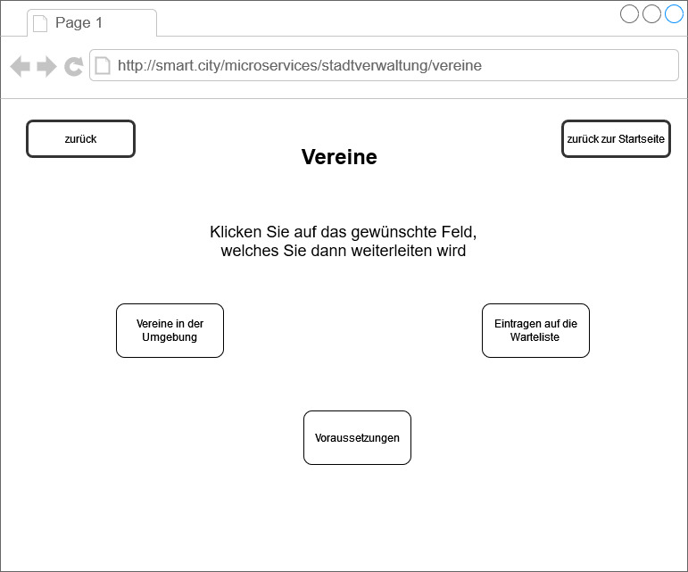
### Voraussetzungen für Vereine
 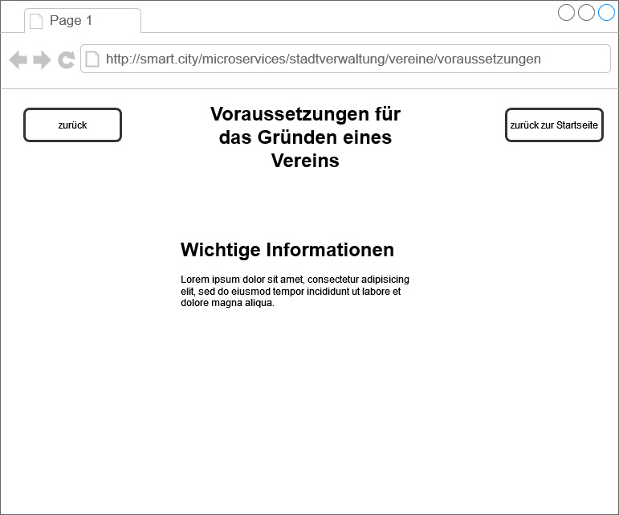
### Eintrag auf die Warteliste für Vereine
 
### Verwaltung der Anträge für Schule und Vereine
 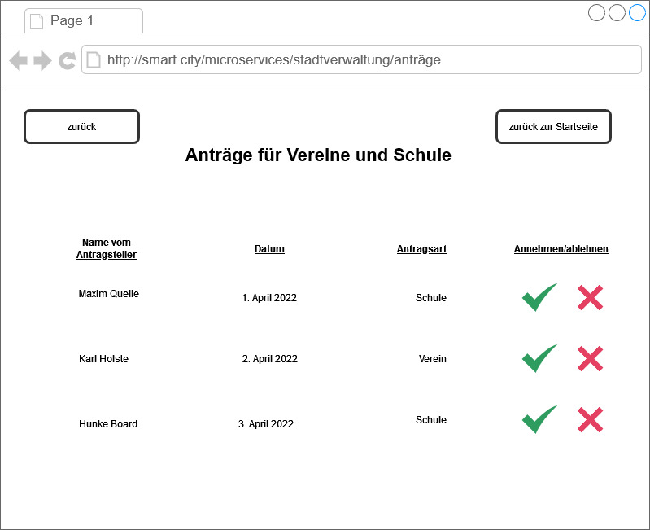

- Unter den Screens darstellen (bzw. verlinken), welche User Stories mit dem Screen abgehandelt werden
- Modellierung der Navigation zwischen den Screens der GUI-Mockups als Zustandsdiagramm
- Mockups für unterschiedliche Akteure


## Datenmodell 

- Begriffe im Glossar darstellen
- Modellierung des physikalischen Datenmodells 
  - RDBMS: ER-Diagramm bzw. Dokumentenorientiert: JSON-Schema

## Abläufe

### Aktivitätsdiagramm für Eintrag in die Warteliste für Schulen
 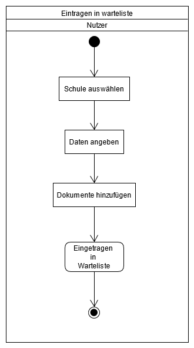
### Anträge in der Warteliste bearbeiten
 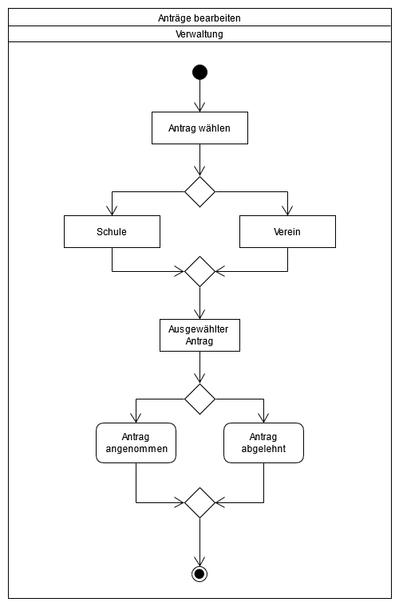
### Swimlanes der Kommunikation zwischen Nutzer, Datenbank und Verwaltung
 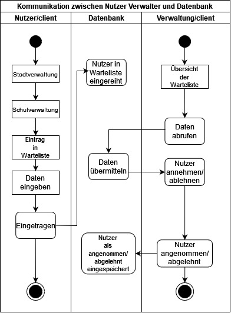


## Schnittstellen

#### Verein erstellen 
POST http://localhost:8080/stadtverwaltung/createclub
```
{
  "club_id": "12"
  "club_name": "Basketballverein"
  "founder": "Max Detroit"
  "member": "20"
  "task": "Basketball"
  "finacing": "Beiträge"
  "description": "Wir sind ein Verein für Basketball"
}
public boolean createclub(int clubID,
                                  String clubName,
                                  String founder,
                                  int member,
                                  String task,
                                  String financing,
                                  String description
                                  ) 
```

#### Schule erstellen 
POST http://localhost:8080/stadtverwaltung/createschool
```
{
  "school_id": "14"
  "school_name": "Grundschule von Bergen"
  "founder": "Dakota Bergen"
}
public boolean createclub(int schoolID,
                                  String clubName,
                                  String founder,
                                  ) 
```

#### Verein Löschen
DELETE http://localhost:8080/stadtverwaltung/deleteclub
```
{
  "club_id": "12"
  "club_name": "Basketballverein"
  "founder": "Max Detroit"
  "member": "20"
  "task": "Basketball"
  "finacing": "Beiträge"
  "description": "Wir sind ein Verein für Basketball"
}
public boolean deleteclub(int clubID) 
```

#### Schule Löschen
DELETE http://localhost:8080/stadtverwaltung/deleteclub
```
{
  "school_id": "24"
  "school_name": "Grundschule von Bergen"
  "founder": "Dakota Bergen"
}
public boolean deleteschool(int schoolID) 
```

**Beispiele:**

### URL für alle Funktionen

http://smart.city/microservices/stadtverwaltung <br>
http://smart.city/microservices/stadtverwaltung/schulverwaltung <br>
http://smart.city/microservices/stadtverwaltung/schulverwaltung/umgebung <br>
http://smart.city/microservices/stadtverwaltung/schulverwaltung/sprechstunden <br>
http://smart.city/microservices/stadtverwaltung/schulverwaltung/eintragen <br>
http://smart.city/microservices/stadtverwaltung/vereine <br>
http://smart.city/microservices/stadtverwaltung/vereine/umgebung <br>
http://smart.city/microservices/stadtverwaltung/vereine/voraussetzungen <br>
http://smart.city/microservices/stadtverwaltung/vereine/eintragen <br>
http://smart.city/microservices/stadtverwaltung/anträge <br>

### Commands

**Synchronous**

| **Anfrageart**| **Name** | **Parameter** | **Resultat** |
| :---------- | :------ | :----- | :------ |
|POST| createschool() | String schoolname | int id |
|DELETE| deleteschool() | String  schoolname | int id |
|POST| createclub() | String clubname | int id |
|DELETE| deleteclub() | String clubname | int id |

**Asynchronous**

| **Anfrageart**| **Name** | **Parameter** | **Resultat** |
| :------ | :----- | :------ | :------ |
| createContract() | int id | int id |
| changeContract() | int id | - |

### Events

**Customer event channel**

| **Anfrageart**| **Name** | **ID** | 
| :------ | :----- | :------ | 
| schoolkid accepted | string school | int id |
| schoolkid rejected | string school | int id |
| club accepted |string clubname | int id |
| club rejected| string clubname | int id |

**Contract event channel**

| **Anfrageart**| **Name** | **Payload** | 
| :------ | :----- | :----- |
| Contract Received | int id |
| Contract Deleted | int id |

### Queries

| **Anfrageart**| **Name** | **Parameter** | **Resultat** |
| :------ | :----- | :------ | :------ |
| getContracts() | - | Contract [] list |
| getContract() | int id | Contract c |

### Dependencies

#### RPC

| **Service** | **Funktion** |
| :------ | :----- | 
| Authorization Service | authenticateUser() |
| Hospital Service | blockDate() |

#### Event-Subscriptions

| **Service** | **Funktion** |
| :------ | :----- | 
| Cinema channel | CancelFilmCreatedEvent |
| Customer reply channel | CreateCustomerEvent |


## Technische Umsetzung


### Softwarearchitektur

- Darstellung von Softwarebausteinen (Module, Schichten, Komponenten)

Hier stellen Sie die Verteilung der Softwarebausteine auf die Rechnerknoten dar. Das ist die Softwarearchitektur. Zum Beispiel Javascript-Software auf dem Client und Java-Software auf dem Server. In der Regel wird die Software dabei sowohl auf dem Client als auch auf dem Server in Schichten dargestellt.

* Server
  * Web-Schicht
  * Logik-Schicht
  * Persistenz-Schicht

* Client
  * View-Schicht
  * Logik-Schicht
  * Kommunikation-Schicht

Die Abhängigkeit ist bei diesen Schichten immer unidirektional von "oben" nach "unten". Die Softwarearchitektur aus Kapitel "Softwarearchitektur" ist demnach detaillierter als die Systemübersicht aus dem Kapitel "Systemübersicht". Die Schichten können entweder als Ganzes als ein Softwarebaustein angesehen werden. In der Regel werden die Schichten aber noch weiter detailliert und in Softwarebausteine aufgeteilt. 


### Entwurf

- Detaillierte UML-Diagramme für relevante Softwarebausteine

### Fehlerbehandlung 

* Mögliche Fehler / Exceptions auflisten
* Fehlercodes / IDs sind hilfreich
* Nicht nur Fehler technischer Art ("Datenbankserver nicht erreichbar") definieren, sondern auch fachliche Fehler wie "Kunde nicht gefunden", "Nachricht wurde bereits gelöscht" o.ä. sind relevant. 

### Validierung

* Relevante (Integrations)-Testfälle, die aus den Use Cases abgeleitet werden können
* Testfälle für 
  - Datenmodell
  - API
  - User Interface
* Fokussieren Sie mehr auf Integrationstestfälle als auf Unittests
* Es bietet sich an, die IDs der Use Cases / User Stories mit den Testfällen zu verbinden,
  so dass erkennbar ist, ob Sie alle Use Cases getestet haben.

### Verwendete Technologien

- Verwendete Technologien (Programmiersprachen, Frameworks, etc.)

* Frontend
  - Vue.js
* Backend
  - Springboot
* Datenbank
  - postgreSql
