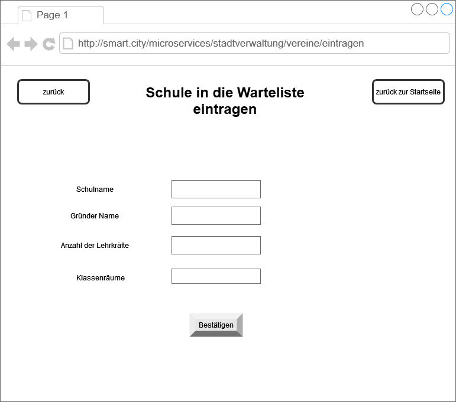
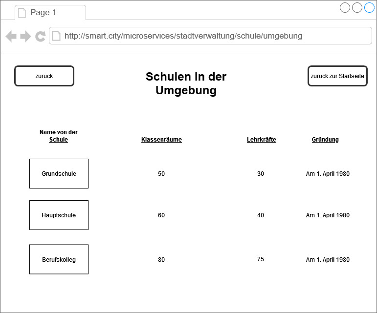
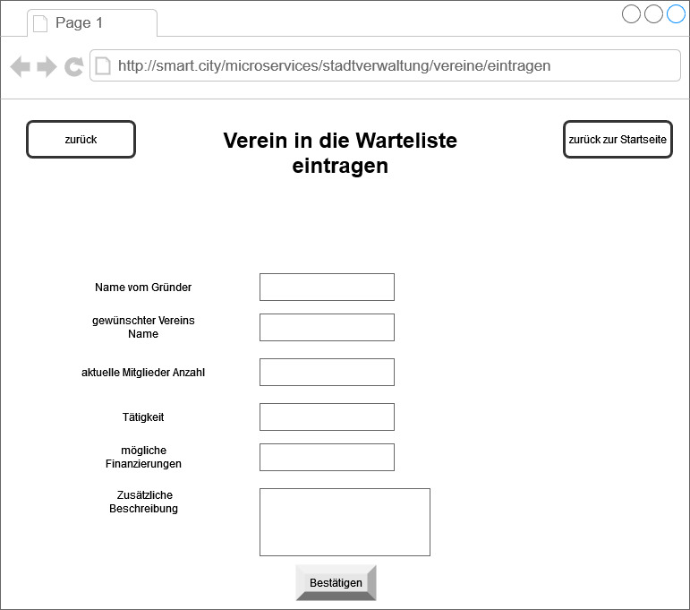
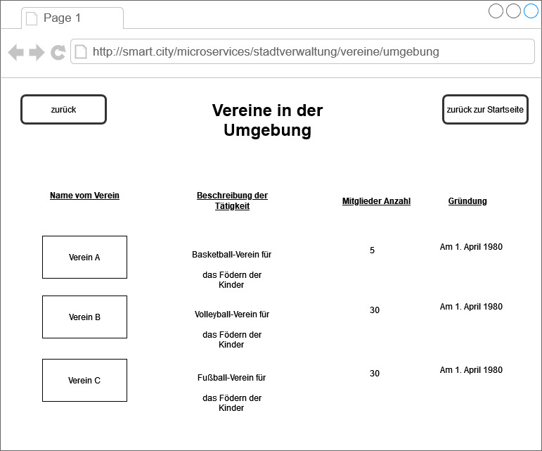

# Stadtverwaltung

**Autor:** Vadim Balysev


## Überblick


- Damit alles schneller und reibungsloser läuft, hat die Stadtverwaltung sich ein Konzept ausgedacht, dass man Kinder Online in eine Warteliste eintragen kann für Schulen.
  So ähnlich läuft es dann auch mit den Vereinen ab, wobei man hier noch bestimmte voraussetzungen Erfüllen muss.
- Konzeptionelles Analyseklassendiagramm (logische Darstellung der Konzepte der Anwendungsdomäne)


## Funktionale Anforderungen


* Akteure:
  - Verwaltung: Kümmert sich um die eingehenden Anträge und das Verwalten des Services
  - Nutzer: kann Anträge stellen für Vereine, Schulen und Einsehen der Übersichten 

* Use-Case Diagramme

### Use-Case Nutzer
 
 
 

### Use-Case Verwaltung
 


## Anforderungen im Detail


**Nutzer User-Stories für Schulverwaltung**

| **Name**| **Als** | **möchte ich** | **so dass** | **Akzeptanz** |
| :-------| :------ | :----- | :------ | :-------- |
| Schulen ansehen | Nutzer | einsehen welche Schulen es in der Umgebung gibt | ich informationen erhalte welche Schulen es schon gibt | Eine Liste von möglichen Schulen |
| Sprechstunden ansehen | Nutzer | einsehen, wann man ein zoom meeting vereinbaren kann | ich informationen erhalten kann | Uhrzeiten mit den möglichen Sprechstunden |
| Eintragen in Wartelisten | Nutzer | mich in eine Warteliste eintragen | ich meine Schule eintragen kann | alle nötigen Daten angeben, für die Einreihung in eine Warteliste |

**Verwaltung User-Stories für Schulverwaltung**

| **Name**| **Als** | **möchte ich** | **so dass** | **Akzeptanz** |
| :------ | :------ | :----- | :------ | :-------- |
| Schulen ansehen | Verwaltung | die Schulen in der Umgebung bearbeiten | ich die Liste immer aktuell halte | bearbeitung der Liste zum ergänzen oder löschen von Schulen |
| Sprechstunden ansehen | Verwaltung | die Zeiten für die Sprechstunden anpassen | ich die Zeiten immer aktuell halte | anpassen der Zeiten |
| Eintragen in Wartelisten | Verwaltung | einsehen welche Anträge angekommen sind | ich die gewünschte Schule eintragen kann | Annahmen von Schule  |

**Nutzer User-Stories für Vereine**

| **Name**| **Als** | **möchte ich** | **so dass** | **Akzeptanz** |
| :------ | :------ | :----- | :------ | :-------- |
| Vereine ansehen | Nutzer | einsehen welche Vereine es in der Umgebung schon gibt | ich eine Übersicht habe  | Eine Liste von möglichen Vereine |
| Voraussetzungen ansehen | Nutzer | einsehen, welche Kriterien erfüllt sein müssen | ich einen Verein Gründen darf | alle nötigen Informationen zum Gründen von einem Verein |
| Eintragen in Wartelisten | Nutzer | meinen Verein in eine Warteliste eintragen | ich meinen Verein registrieren kann | alle nötigen Daten angeben mit Dokumenten, für die Einreihung in eine Warteliste |

**Verwaltung User-Stories für Vereine**

| **Name**| **Als** | **möchte ich** | **so dass** | **Akzeptanz** |
| :------ | :------ | :----- | :------ | :-------- |
| Vereine ansehen | Verwaltung | die Vereine in der Umgebung bearbeiten | ich die Liste immer aktuell halte  | bearbeitung der Liste zum ergänze oder löschen von Vereinen |
| Voraussetzungen bearbeiten | Verwaltung | die Voraussetungen anpassen können | man immer die aktuellen Voraussetzungen hat | Alle nötigen Informationen zum Gründen von einem Verein |
| Warteliste ansehen und bearbeiten | Verwaltung | einsehen welche Anträge angekommen sind | ich diese bearbeiten kann | Eine liste der eingetragenen Vereine zum an oder ablehnen |

## Graphische Benutzerschnittstelle

### Stadtverwaltung
 
### Startseite für Schulverwaltung
 
### Sprechstunden
  
### Eintrag auf die Warteliste für Schulen
 
### Schulen in der Umgebung
 
### Startseite für Vereine
 
### Voraussetzungen für Vereine
 
### Eintrag auf die Warteliste für Vereine
 
### Vereine in der Umgebung
 
### Verwaltung der Anträge für Schule und Vereine
 


## Abläufe

### Aktivitätsdiagramm für Eintrag in die Warteliste für Schulen
 
### Anträge in der Warteliste bearbeiten
 
### Swimlanes der Kommunikation zwischen Nutzer, Datenbank und Verwaltung
 


## Schnittstellen

#### Verein erstellen 
POST http://localhost:8080/stadtverwaltung/create-club
```
{
  "club_id": "12"
  "club_name": "Basketballverein"
  "founder": "Max Detroit"
  "member": "20"
  "task": "Basketball"
  "finacing": "Beiträge"
  "description": "Wir sind ein Verein für Basketball"
}
public boolean createclub(int clubID,
                                  String clubName,
                                  String founder,
                                  int member,
                                  String task,
                                  String financing,
                                  String description
                                  ) 
```

#### Schule erstellen 
POST http://localhost:8080/stadtverwaltung/create-school
```
{
  "school_id": "14"
  "school_name": "Grundschule von Bergen"
  "founder": "Dakota Bergen"
  "teacher": "24"
  "classrooms": "24"
}
public boolean createclub(int schoolID,
                                  String clubName,
                                  String founder,
                                  int teacher,
                                  int classrooms
                                  ) 
```

#### Verein Löschen
DELETE http://localhost:8080/stadtverwaltung/delete-club
```
{
  "club_id": "12"
  "club_name": "Basketballverein"
  "founder": "Max Detroit"
  "member": "20"
  "task": "Basketball"
  "finacing": "Beiträge"
  "description": "Wir sind ein Verein für Basketball"
}
public boolean deleteclub(int clubID) 
```

#### Schule Löschen
DELETE http://localhost:8080/stadtverwaltung/delete-school
```
{
  "school_id": "14"
  "school_name": "Grundschule von Bergen"
  "founder": "Dakota Bergen"
  "teacher": "24"
  "classrooms": "24"
}
public boolean deleteschool(int schoolID) 
```
#### Vereins Liste Anzeigen
GET http://localhost:8080/stadtverwaltung/club-list
```
{
  "club_id": "12"
  "club_name": "Basketballverein"
  "founder": "Max Detroit"
  "member": "20"
  "task": "Basketball"
  "finacing": "Beiträge"
  "description": "Wir sind ein Verein für Basketball"
}
public boolean deleteclub(int clubID) 
```

#### Schul Liste Anzeigen
GET http://localhost:8080/stadtverwaltung/school-list
```
{
  "school_id": "14"
  "school_name": "Grundschule von Bergen"
  "founder": "Dakota Bergen"
  "teacher": "24"
  "classrooms": "24"
}
public boolean deleteschool(int schoolID) 
```

**Beispiele:**

### URL für alle Seiten der Stadtverwaltung

http://smart.city/microservices/stadtverwaltung <br>
http://smart.city/microservices/stadtverwaltung/schulverwaltung <br>
http://smart.city/microservices/stadtverwaltung/schulverwaltung/umgebung <br>
http://smart.city/microservices/stadtverwaltung/schulverwaltung/sprechstunden <br>
http://smart.city/microservices/stadtverwaltung/schulverwaltung/eintragen <br>
http://smart.city/microservices/stadtverwaltung/vereine <br>
http://smart.city/microservices/stadtverwaltung/vereine/umgebung <br>
http://smart.city/microservices/stadtverwaltung/vereine/voraussetzungen <br>
http://smart.city/microservices/stadtverwaltung/vereine/eintragen <br>
http://smart.city/microservices/stadtverwaltung/anträge <br>

### Commands

**Synchronous**

| **Anfrageart**| **Name** | **Parameter** | **Resultat** |
| :---------- | :------ | :----- | :------ |
|POST| createschool() | String schoolname | int id |
|DELETE| deleteschool() | String  schoolname | int id |
|POST| createclub() | String clubname | int id |
|DELETE| deleteclub() | String clubname | int id |
|GET| clublist() | String clubname | int id |
|GET| schoollist() | String clubname | int id |


**Asynchronous**

| **Anfrageart**| **Name** | **Parameter** | **Resultat** |
| :------ | :----- | :------ | :------ |
| GET | getCustomer() | String Customer | int id |


### Events

**Customer event channel**

| **Anfrageart**| **Name** | **ID** | 
| :------ | :----- | :------ | 
| school accepted | string school | int id |
| school rejected | string school | int id |
| club accepted |string clubname | int id |
| club rejected| string clubname | int id |

## Technische Umsetzung

### Fehlerbehandlung

- Fehlende Daten in der Datenbank durch das eintragen eines Verein oder einer Schule.
  - Eine Exception damit man keine null Werte in der Datenbank hat.
- Fehler beim ausführen des Backends mit der Datenbank.
  - Den richtigen Namen, Passwort und Usernamen für die Datenbank als variable eingeben.
- Daten werden nicht richtig in der Datenbank gespeichert durch das anwenden vom Frontend.
  - Beim Frontend auf groß und klein Schreibung achten, damit die **Parameter** genau so heißen wie im Backend.

### Verwendete Technologien

- Verwendete Technologien (Programmiersprachen, Frameworks, etc.)

* Frontend
  - Vue.js
* Backend
  - Springboot
* Datenbank
  - postgreSql
* Verwendete Programme
  - Visual Studio Code
  - Intellij
  - DBeaver
  - Docker
  - Postman
  - RabbitMQ
